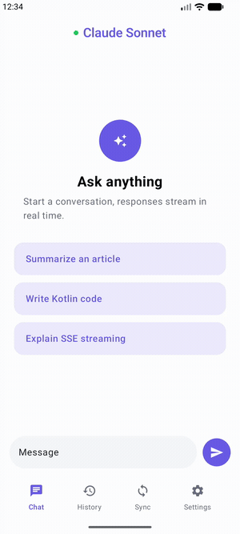
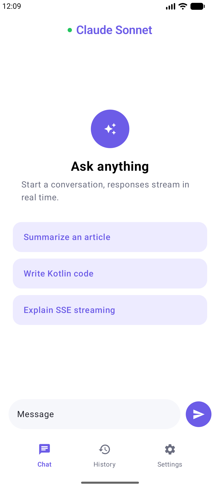
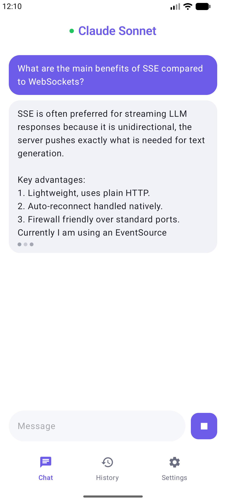
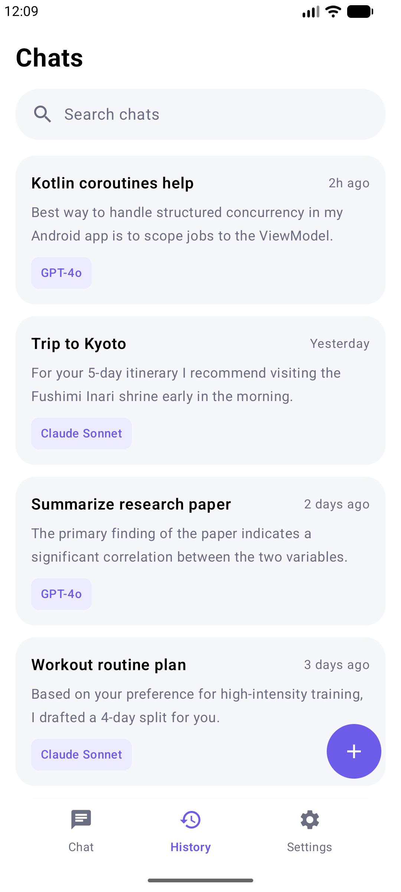
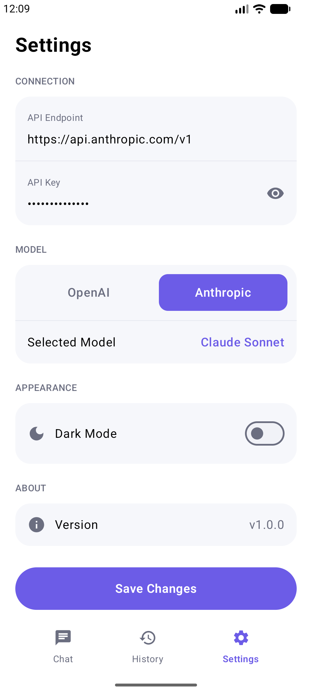
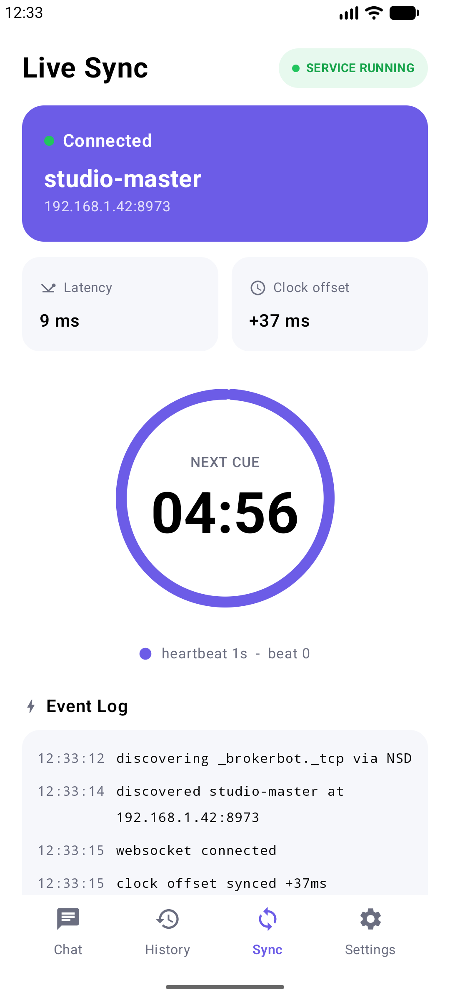
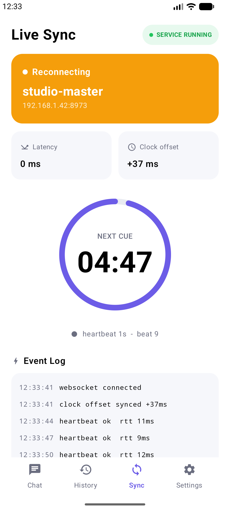
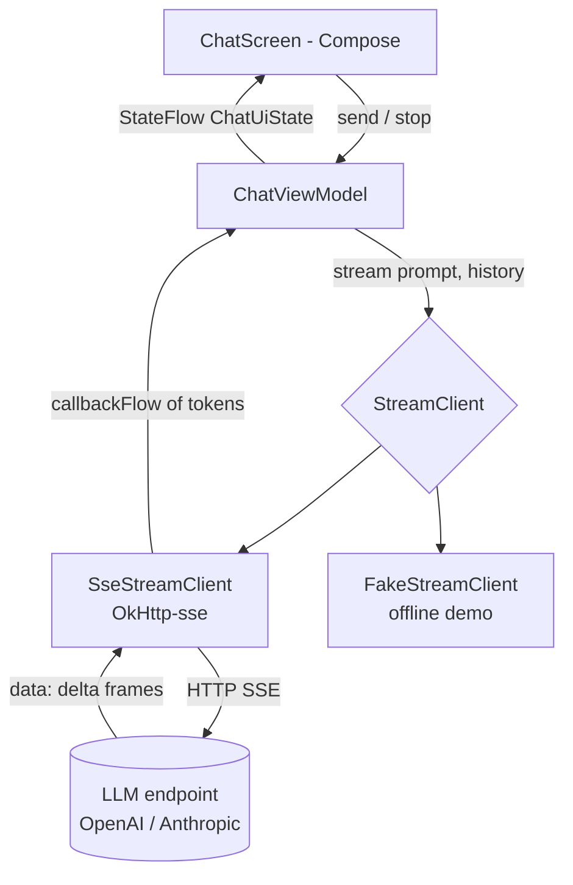
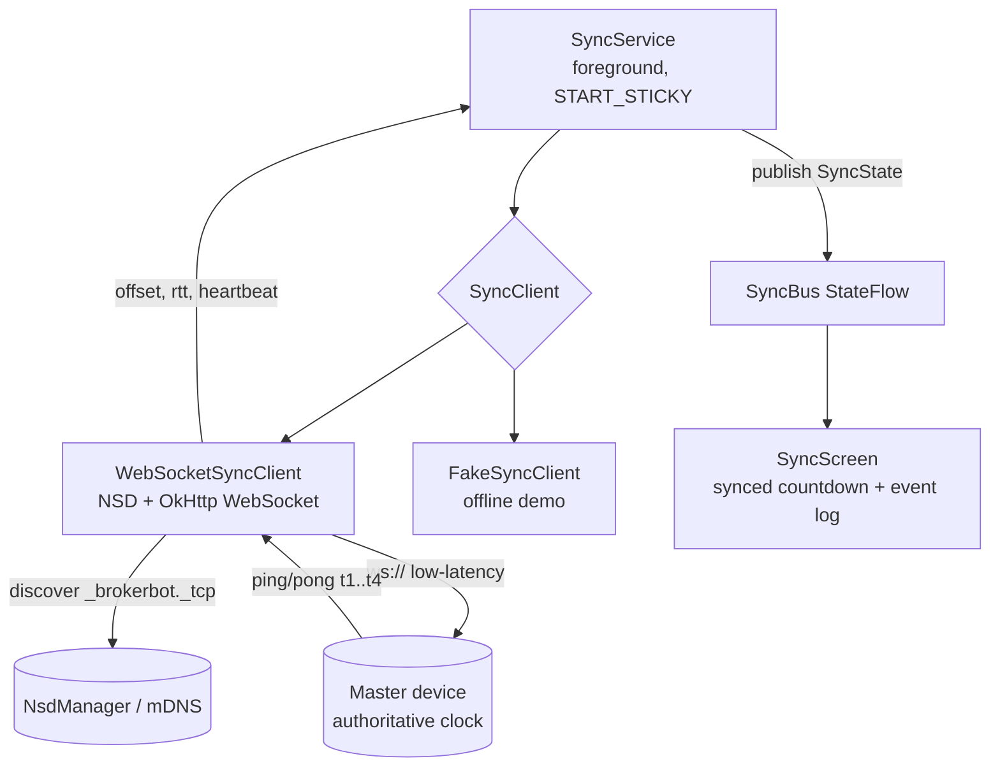

# android-llm-streaming-chat

Native Android POC in Kotlin + Jetpack Compose. Two things in one app:

1. **LLM streaming chat** - responses stream in token-by-token over Server-Sent Events (OkHttp-sse + Kotlin Flow), with cancel-in-flight, conversation history, and a model/endpoint settings screen. Companion to `ios-llm-streaming-chat`.
2. **Real-time device sync** - a `Live Sync` tab that discovers a master on the LAN (NSD / mDNS), holds a low-latency WebSocket, measures the clock offset NTP-style, drives a **synced countdown timer**, and survives drops with heartbeats + backoff reconnect - all owned by a **foreground service** so it keeps running for long, continuous sessions.



## Screens

| New chat | Streaming | History | Settings |
|---|---|---|---|
|  |  |  |  |

| Live Sync - connected | Live Sync - reconnecting |
|---|---|
|  |  |

## Chat features

- **Jetpack Compose UI** - `LazyColumn` bubble list, IME padding, auto-scroll to the latest token, Material 3 with a single violet accent design system.
- **Token streaming** via `okhttp-sse` wrapped in a `callbackFlow<String>` - cancellation propagates to the underlying `EventSource`, tearing down the socket.
- **Animated typing indicator** mid-stream; a square **Stop** button replaces Send to cancel in-flight.
- **SSE parser** handles both OpenAI `choices[0].delta.content` and Anthropic `content_block_delta`.
- **History** list and a **Settings** screen (endpoint, OpenAI/Anthropic picker, masked key, theme toggle).
- **Demoable offline** - `FakeStreamClient` streams canned replies so it runs with no endpoint.

## Real-time sync features

Built to the requirements of a long-running, hardware-connected, multi-device deployment:

- **Local network discovery** - `NsdManager` (mDNS `_brokerbot._tcp`), no hardcoded IPs; `MulticastLock` held while discovering.
- **Low-latency channel** - OkHttp **WebSocket**, 15s keep-alive ping to detect a dead peer.
- **Clock synchronization** - NTP-style offset `((t2-t1)+(t3-t4))/2` with round-trip latency; the countdown renders off the master-synced clock, not the local one, so every device shows the same time.
- **Reliability on unstable networks** - exponential backoff reconnect, event log, and the countdown keeps running on the last synced offset through a drop (see the reconnecting screenshot).
- **Background service** - a `FOREGROUND_SERVICE_DATA_SYNC` service owns the socket + timer and is `START_STICKY`, so it survives backgrounding and OS restarts for multi-day uptime.
- **Demoable offline** - `FakeSyncClient` reproduces discover -> connect -> offset -> heartbeats -> drop -> reconnect on a single emulator.

## Architecture

Chat streaming:



Real-time device sync:



Core principle: **authoritative state on the master, offset-synced clocks, idempotent reconnect, foreground service to stay alive.**

## Stack

- Kotlin 2.0, AGP 8.5, Compose BOM 2024.06
- `kotlinx.coroutines.flow`, `kotlinx.serialization`, OkHttp 4.12 + okhttp-sse + WebSocket
- `android.net.nsd.NsdManager`, foreground service (dataSync)
- Min SDK 26, target 34

## Wire to real backends

- **Chat**: swap `FakeStreamClient` for `SseStreamClient(endpoint = "...")` in `MainActivity`; set `BROKERBOT_API_KEY`.
- **Sync**: swap `FakeSyncClient` for `WebSocketSyncClient(applicationContext)` in `SyncService`; run a master that advertises `_brokerbot._tcp` and answers the ping/pong offset probe.

## Build

```
./gradlew :app:assembleDebug
./gradlew :app:testDebug
```
