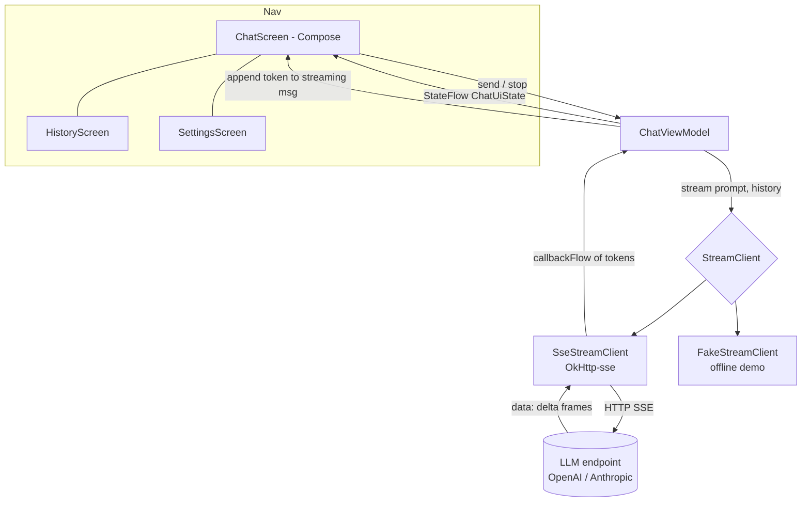

# android-llm-streaming-chat

Native Android LLM streaming chat POC - Kotlin + Jetpack Compose + OkHttp-SSE + Kotlin Flow. Companion to `ios-llm-streaming-chat` for a BrokerBot-style AI chat experience: responses stream in token-by-token over Server-Sent Events, with cancel-in-flight, a conversation history list, and a model/endpoint settings screen.


## Screens

| New chat | Streaming | History | Settings |
|---|---|---|---|
|  |  |  |  |

## Features

- **Jetpack Compose UI** - scrolling `LazyColumn` bubble list, IME padding, auto-scroll to the latest token, Material 3 theming with a single violet accent design system.
- **Token streaming** via `okhttp-sse` wrapped in a `callbackFlow<String>` - cancellation propagates to the underlying `EventSource`, so cancelling the coroutine tears down the socket.
- **Animated typing indicator** while a message is mid-stream; a square **Stop** button replaces Send to cancel in-flight generation.
- **SSE parser** handles both OpenAI `choices[0].delta.content` and Anthropic `content_block_delta` framing.
- **Conversation history** list with title, last-message preview, relative timestamp, and model badge.
- **Settings** - API endpoint, OpenAI / Anthropic model picker, masked API key, and a theme toggle.
- **ViewModel + StateFlow** with `collectAsStateWithLifecycle`, cancel-in-flight via `Job.cancel()`.
- **Demoable offline** - a `FakeStreamClient` streams canned replies word-by-word so the app runs on a simulator with no endpoint or key.
- **Testable** - `StreamClient` interface stubbed in `ChatViewModelTest` using Turbine.

## Architecture



Each token flows: endpoint -> `EventSource.onEvent` -> `decodeToken` (OpenAI/Anthropic shape) -> `trySend` into the `callbackFlow` -> `ChatViewModel.collect` -> append to the streaming `ChatMessage` -> Compose recomposes the bubble.

## Stack

- Kotlin 2.0, AGP 8.5, Compose BOM 2024.06, Navigation-less tab host
- `kotlinx.coroutines.flow`, `kotlinx.serialization`, OkHttp 4.12 + okhttp-sse
- Min SDK 26, target 34

## Wire to a real endpoint

The demo build uses `FakeStreamClient`. To hit a real backend, swap it in `MainActivity`:

```kotlin
ChatViewModel(SseStreamClient(endpoint = "https://api.anthropic.com/v1/..."))
```

Set the `BROKERBOT_API_KEY` env var (added as a Bearer header). The parser already handles OpenAI + Anthropic SSE shapes.

## Build

```
./gradlew :app:assembleDebug
./gradlew :app:testDebug
```
